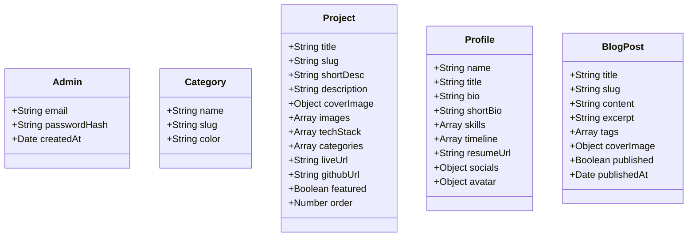

# MERN Portfolio App Walkthrough

This document outlines the architectural blueprint, database schemas, styling variables, page routers, and administrative CRUD features implemented for the Portfolio Showcase Application.

---

## 1. Technical Stack Overview

The application is structured as a monorepo consisting of a separate backend server and frontend client:

*   **Database**: MongoDB Atlas using Mongoose schemas (exponential connection retry configured).
*   **Backend Server**: Node.js & Express.js with Cookie-based JWT authentication, multer upload routers (dual-mode Cloudinary or local uploads), and global async wrapper error middleware.
*   **Frontend Client**: React 18 powered by Vite, styled using Tailwind CSS v3 with a custom blue color theme.
*   **State Management & Caching**: TanStack Query (React Query v5) for synchronizing client queries and cache invalidations.
*   **Public Markdown Rendering**: `react-markdown` with GFM table support and rehype highlight code syntax coloring.

---

## 2. Core Schemas & Database Models



---

## 3. Styling Accent Variables

The frontend theme has been configured inside `client/tailwind.config.js` with the following variables:

| Token | HSL / Hex Code | Usage |
| :--- | :--- | :--- |
| **Primary Button / Focus Rings** | `blue-600` (`#185FA5`) | Accent buttons, active menu states, focus rings |
| **Hover State** | `blue-400` (`#378ADD`) | Navigation items hover, interactive buttons hover |
| **Badge Background** | `blue-100` (`#B5D4F4`) | Category backgrounds, technical tags |
| **Badge Text Color** | `blue-800` (`#0C447C`) | Text inside category tags |
| **Navbar Background** | `blue-900` (`#042C53`) | Sticky headers, desktop & mobile admin navigation sidebar |

---

## 4. Application Router Mapping

```
portfolio-monorepo/
  ├── client/
  │    └── src/
  │         ├── App.jsx (Routes wrapper)
  │         ├── main.jsx (TanStack Query, SEO Providers)
  │         ├── pages/
  │         │    ├── HomePage.jsx (Hero, Featured strip, Contact form)
  │         │    ├── ProjectsPage.jsx (Categorized filters, Search bar)
  │         │    ├── ProjectDetail.jsx (Markdown view, Screenshot gallery)
  │         │    ├── AboutPage.jsx (Timeline progress, CV downloads)
  │         │    ├── BlogPage.jsx (Articles list cards)
  │         │    ├── BlogPostPage.jsx (Detailed post with syntax coloring)
  │         │    └── NotFoundPage.jsx (Custom 404 alert page)
  │         └── admin/
  │              ├── LoginPage.jsx (Secure email/pass card)
  │              ├── AdminLayout.jsx (Protected route sidebar, Mobile topbar)
  │              ├── DashboardPage.jsx (Metrics counters, Recent activity list)
  │              ├── projects/ (ProjectsAdmin list table, ProjectForm creator)
  │              ├── about/ (AboutProfile form, Journey events manager)
  │              ├── blog/ (BlogAdmin table list, PostForm text editor)
  │              └── categories/ (Categories list & Modals modification)
```

---

## 5. Administrative Dashboard Screen

Below is a preview of the fully-featured administrative control dashboard, showing the active metrics statistics cards and recent portfolio activity feeds:


> [!NOTE]
> All dashboard endpoints are protected by `httpOnly` secure cookies mapping JWT credentials. Logouts immediately invalidate local user contexts.
